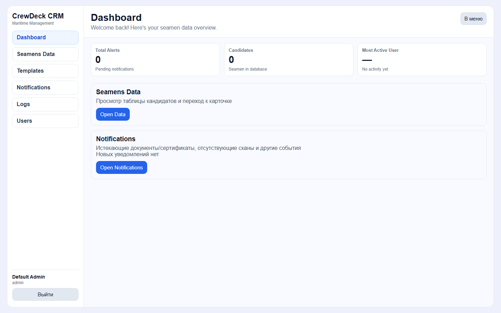
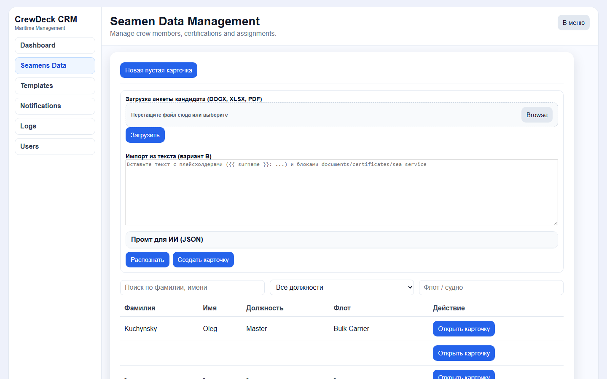
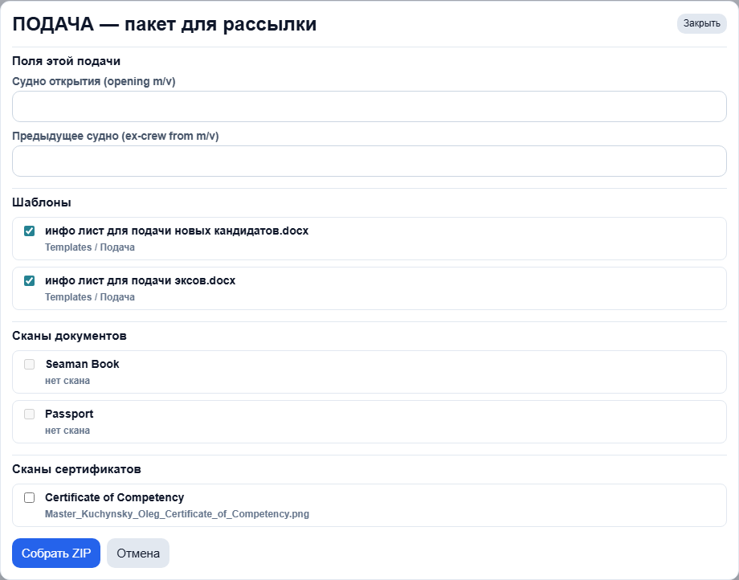
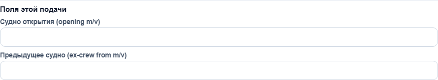
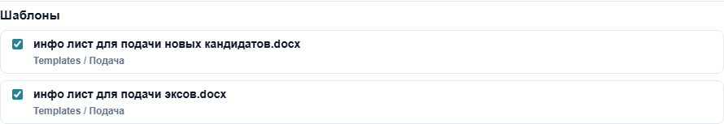
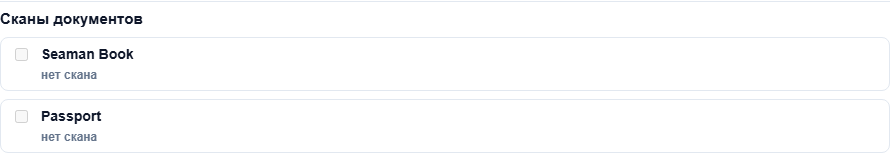

# ПОДАЧА и обновления CRM — инструкция для сотрудников

Документ для рекрутеров и офиса: что появилось в системе за последние дни и как пользоваться кнопкой **ПОДАЧА** на карточке кандидата.

**Адрес системы (локально / Docker):** http://127.0.0.1:5173  
**Вход:** логин и пароль (по умолчанию в тестовой среде `admin` / `admin123` — на проде свои учётные данные).



---

## 1. Что нового (кратко)

| Функция | Зачем |
|--------|--------|
| **Кнопка «ПОДАЧА»** | Собрать **один ZIP-архив** для отправки судовладельцу / менеджменту: сгенерированные info-list DOCX + выбранные сканы. |
| **Поля info-list в карточке** | Данные для текста письма (аэропорт, зарплата, ECDIS, вакцинация, причина ухода и т.д.) хранятся в CRM и подставляются в шаблоны. |
| **Два встроенных шаблона** | «Инфо лист для подачи **новых** кандидатов» и «… **эксов**» (папка Templates → Podacha). |
| **Имена сканов** | При загрузке, скачивании и в ZIP файлы называются единообразно: `Должность_Фамилия_Имя_ТипДокумента.pdf`. |
| **Парсинг OVERSEAS-анкет** | Из форм типа *MST … OVERSEAS Application Form* дополнительно заполняются Latin/Native name, семейное положение, страна/регион и контакт супруга (если есть в анкете). |

**Важно:** кнопка **«Сгенерировать документы»** по-прежнему отдельная — она скачивает выбранные шаблоны **по одному файлу**, без ZIP и без пакета сканов. Для подачи на судно используйте **ПОДАЧА**.

---

## 2. Кнопка «ПОДАЧА» — пошагово

### Шаг 1. Откройте список кандидатов

В левом меню выберите **Seamens Data**.



Нажмите **«Открыть карточку»** у нужного моряка (или создайте карточку и загрузите анкету).

### Шаг 2. Найдите кнопку «ПОДАЧА»

В верхней панели карточки — рядом с **«Сгенерировать документы»** и **«Украинский контракт»**.


### Шаг 3. Откройте окно «ПОДАЧА — пакет для рассылки»

Нажмите **ПОДАЧА**. Откроется модальное окно с блоками: судна, шаблоны, сканы.



#### 2.1. Поля этой подачи (только для этого ZIP)

Заполняются **вручную в окне** — в карточку кандидата **не сохраняются**:

| Поле | Назначение |
|------|------------|
| **Судно открытия (opening m/v)** | Судно, на которое подаём кандидата. По умолчанию может подставиться из раздела Recruitment → Proposed Vessel. |
| **Предыдущее судно (ex-crew from m/v)** | Для шаблона **эксов** — с какого судна кандидат (ex-crew). |



Эти значения попадают в текст info-list.

#### 2.2. Шаблоны

- Список **DOCX** из **Templates** (менеджер шаблонов).
- При открытии окна обычно **уже отмечены** файлы с названием **«инфо лист»** (в т.ч. из папки **Podacha**).
- Можно снять/добавить галочки — в ZIP попадут только отмеченные шаблоны.
- В пакет попадают **только .docx** (не PDF/Excel).



**Стандартные шаблоны:**

- `инфо лист для подачи новых кандидатов.docx` — новый кандидат на opening m/v.
- `инфо лист для подачи эксов.docx` — ex-crew с previous m/v на opening m/v.

#### 2.3. Сканы документов и сертификатов

- Отдельные списки по разделам **Documents** и **Certificates** карточки.
- Галочку можно поставить **только если к строке уже прикреплён скан** (иначе пункт неактивен, подпись «нет скана»).
- **Sea Service (морской стаж) в ПОДАЧА не включается** — только документы и сертификаты.



#### 2.4. Сборка ZIP

1. Отметьте хотя бы **один шаблон** и/или **один скан**.
2. Нажмите **«Собрать ZIP»**.
3. Браузер скачает файл вида `PODACHA_Фамилия_ID_xxxxxxxx.zip`.


**Содержимое ZIP:**

- Сгенерированные **.docx** по выбранным шаблонам (данные из карточки кандидата).
- Выбранные **сканы** с понятными именами (см. раздел 4).

Отправку письма из CRM система **не делает** — ZIP скачивается на компьютер; дальше прикрепляете его в Outlook / Teams сами.

### Типичные ошибки

| Сообщение | Что сделать |
|-----------|-------------|
| «Выберите хотя бы один шаблон или скан» | Отметьте галочки в шаблонах или сканах. |
| «нет скана» | Загрузите скан в карточке (Documents / Certificates), затем снова откройте ПОДАЧА. |
| «API ПОДАЧА не найден (404)» | Сообщите IT: нужен перезапуск backend (`docker compose up -d`). |
| Другая ошибка в красной строке | Прочитайте текст; часто — отсутствующий файл скана на сервере. |

---

## 3. Какие поля карточки нужны для info-list

Перед ПОДАЧА имеет смысл проверить/заполнить в карточке (разделы **Персональные данные**, **Recruitment**, **Documents**, **Certificates**):

### Обязательно для осмысленного письма

- Фамилия, имя, должность / rank  
- Данные паспорта, COC, seaman book (даты в Documents / Certificates)  
- **Recruitment:** желаемая зарплата, дата доступности — если есть в процессе подачи  

### Блок «Submission / info-list» (в карточке)

| Поле в CRM | Для чего в письме |
|------------|-------------------|
| Home Airport | Аэропорт вылета |
| Desirable Salary USD | Желаемая зарплата (+ Rejoin Bonus USD при необходимости) |
| Contract Duration (submission) | Желаемая длительность контракта |
| ECDIS Systems | Опыт ECDIS |
| Vaccination Summary | Вакцинация |
| Leaving Reason | Причина ухода с прошлых компаний |
| Employer Reference Note | Референс работодателя |
| Passport / Visa Note (info list) | Статус паспорта/визы |
| COC / GMDSS Expiry Note | Сроки COC/GMDSS |
| COC has QR codes | Галочка — абзац про QR-коды на сертификатах |

Поля **opening / previous vessel** задаются **только в окне ПОДАЧА**, не в карточке.

### Загрузка анкеты из Word

При загрузке **DOCX** (в т.ч. OVERSEAS Application Form) система по возможности заполняет карточку сама. Для анкет без отдельных колонок Latin/Country часть полей **достраивается автоматически** (ФИО → Latin name, адрес → Country/Region, супруг → **Family contacts**).

Если карточка создана **до обновления парсера** — загрузите анкету **ещё раз** (или подтвердите обновление дубликата).

---

## 4. Имена файлов сканов

Везде один формат:

```text
Должность_Фамилия_Имя_ТипДокумента.расширение
```

**Пример:** `Master_Kuchynsky_Oleg_Passport.pdf`

- **Должность** — rank из карточки или заявки.  
- **Тип** — тип документа или сертификата (Passport, Seaman Book, COC и т.д.).  

Такие имена используются при скачивании скана, в CRM и внутри **ZIP ПОДАЧА**.

---

## 5. Отличие «ПОДАЧА» и «Сгенерировать документы»

| | **ПОДАЧА** | **Сгенерировать документы** |
|---|------------|---------------------------|
| Результат | Один **ZIP** | Несколько отдельных **.docx** |
| Сканы | Можно добавить в архив | Нет |
| Судна opening/previous | Поля в окне ПОДАЧА | Нет |
| Шаблоны info-list | Рекомендуется | Любые DOCX из Templates |
| Типичное использование | Пакет на судовладельца | Разовая генерация одного документа |

---

## 6. Роли и доступ

- **ПОДАЧА** и загрузка анкет: роли **admin** и **recruiter**.
- **Viewer** — только просмотр, без сборки пакета.

---

## 7. Чек-лист перед отправкой пакета

1. Карточка заполнена (анкета загружена или данные внесены вручную).  
2. В **Documents** / **Certificates** прикреплены сканы к нужным строкам.  
3. Заполнены поля **Submission / info-list**, если они нужны в письме.  
4. Открыта **ПОДАЧА** → указаны **opening m/v** (и **previous m/v** для экса).  
5. Отмечены нужные **инфо листы** и **сканы**.  
6. **Собрать ZIP** → проверить архив → отправить клиенту почтой.

---

## 8. Кому писать при сбоях

- Не скачивается ZIP, 404, пустые поля после загрузки — **IT / администратор**.  
- Неверный текст в шаблоне — **ответственный за Templates** (папка Podacha).  
- Ошибки в данных — проверьте карточку и повторную загрузку анкеты.

---

## Обновление скриншотов и Word-версии

Скриншоты в папке `docs/screenshots/podacha/` (скрипт `node scripts/capture_podacha_screenshots.cjs`, нужен запущенный CRM на :5173).

Сборка Word:

```powershell
cd C:\Users\berni\Documents\Parcer
python scripts/build_docs_docx.py
```

Файл: `docs/PODACHA_INSTRUCTION_STAFF_RU.docx`

---

*Версия: май 2026.*
